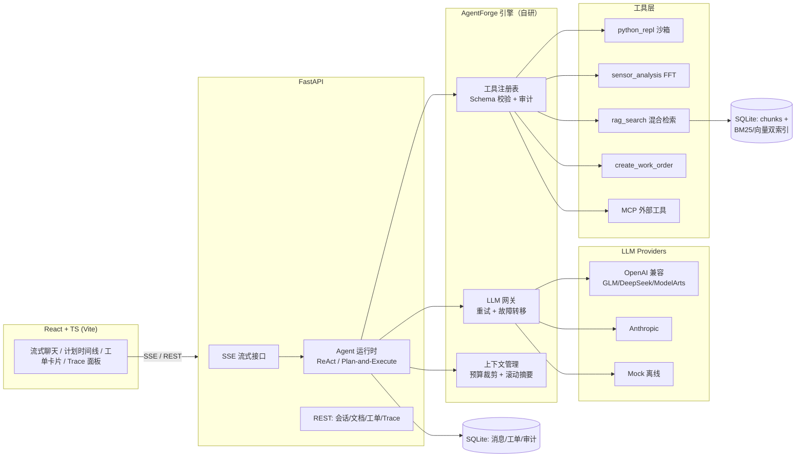

<div align="center">

# ⚒ ForgeOps · 工业设备智能运维平台

**基于自研 Agent 引擎 [AgentForge](docs/architecture.md) 的行业级 AI Agent 应用**

面向制造业/能源行业的设备故障诊断与维修决策：知识库检索 → 传感器数据分析 → 诊断结论（含证据链） → 自动生成维修工单

[](../../actions)


**零配置即可运行**：不配置任何 LLM API Key，内置 Mock Provider 会完整演示规划、工具调用与流式输出全流程。

</div>

---

## 为什么不是"又一个 Agent 框架"

通用 Agent 演示很多，能落地的很少。本项目的核心是针对**行业 Agent 落地的五大难点**逐一给出工程解法，并用设备运维这个真实场景把它们串起来：

| 行业 Agent 落地难点 | 本项目的解法 | 实现位置 |
|---|---|---|
| **长任务不可靠**：多步任务跑偏、中途失败全部重来 | **Plan-and-Execute 编排**：Planner 显式拆解计划 → Executor 分步执行（每步独立 ReAct 循环）→ Synthesizer 汇总结论；每步完成即持久化，部分进度不丢 | [`agent/core.py`](src/agentforge/agent/core.py) |
| **单代理能力天花板**：复杂诊断需要多角色协作 | **多智能体子代理**（Claude Code 式）：主代理并行派出知识研究员/数据分析师（独立上下文+受限工具集+防递归），汇总报告 | [`tools/subagent.py`](src/agentforge/tools/subagent.py) |
| **高风险操作失控**：P1/P2 工单直接中断生产 | **Human-in-the-Loop 审批门**：P1/P2 工单创建前挂起等待人工批准（SSE 内实时等待，UI 批准/拒绝），拒绝结果回传模型自行调整 | [`forgeops/tools.py`](src/agentforge/forgeops/tools.py) |
| **结论不可信**：LLM 自我说服无复核 | **Reflexion 自我批判**：Critic 对照步骤证据审核最终回答（数值一致性），不通过强制修订一轮 | [`agent/core.py`](src/agentforge/agent/core.py) |
| **不越用越懂业务**：每次会话从零开始 | **长期记忆**（MemGPT 式）：工单生成即沉淀设备维度诊断记忆，跨会话自动召回注入 | [`persistence/models.py`](src/agentforge/persistence/models.py) |
| **工具生态碎片化**：每个集成都要写胶水代码 | **MCP 协议接入**：作为 MCP Client 通过 stdio JSON-RPC 挂载外部工具服务器（故障即降级，不影响平台）；自身能力也可封装为 MCP Server 供 Claude Desktop / Cursor 等使用 | [`mcp_client.py`](src/agentforge/mcp_client.py) · [示例 Server](examples/mcp_servers/maintenance_calculator.py) |
| **输出不可控**：LLM 自由文本无法对接业务系统 | **结构化产出 Guardrail**：维修工单必须通过 JSON Schema 校验（字段/枚举/类型），不合法的参数作为错误回传给模型自我纠正；合法工单落库可查 | [`forgeops/tools.py`](src/agentforge/forgeops/tools.py) |
| **黑盒难调试**：不知道 Agent 为什么这么做 | **全链路 Trace**：计划→步骤→每次工具调用（参数/结果/耗时）→ token 成本，全部从持久化审计日志重建，重启不丢，UI 一键查看 | [`routes/chat.py`](src/agentforge/server/routes/chat.py) · Trace 面板 |
| **效果无法度量**："感觉变好了"不是工程语言 | **行业评测集 + CI 回归门禁**：诊断场景断言工具编排序列与结论内容，`agentforge eval` 一键回归，CI 低于阈值即失败 | [`examples/suites/forgeops.yaml`](examples/suites/forgeops.yaml) |

此外，**安全底线**内建：代码执行跑在带 CPU/内存 RLIMIT + 墙钟超时的子进程沙箱；网页抓取有 SSRF 防护（私网地址/重定向逐跳校验）；API Key 认证与令牌桶限流默认开启。

## 核心功能

- 🧠 **双编排模式**：ReAct（快速问答）/ Plan-and-Execute（复杂诊断），SSE 实时推送计划与步骤进度
- 🤖 **多智能体**：`dispatch_subagent` 并行派出专家子代理（知识研究员/数据分析师），隔离上下文 + 受限工具集 + 防递归
- 🧐 **Reflexion 审核**：Critic 对照证据审查结论，不通过带意见修订一轮
- ✋ **Human-in-the-Loop**：P1/P2 工单创建前挂起等待人工批准（UI 实时审批）
- 🧠 **长期记忆**：设备维度诊断记忆跨会话沉淀与召回
- ⚡ **并行工具执行**：单轮多工具 asyncio 并发，事件桥实时流式
- 🔌 **多厂商 LLM 网关**：OpenAI 兼容协议（OpenAI / GLM / DeepSeek / Kimi / Qwen / **华为云 ModelArts MaaS** / Ollama / vLLM）+ Anthropic，统一抽象，指数退避重试 + **部分输出不重复的跨厂商故障转移**
- 🛠 **沙箱工具**：`python_repl`（子进程沙箱代码解释器）、`sensor_analysis`（numpy FFT 频谱分析）、`rag_search`、`web_fetch`（SSRF 防护）、`create_work_order`（Schema 校验工单）、MCP 外部工具
- 📚 **混合检索 RAG**：BM25（jieba 中文分词）+ 向量检索（本地确定性 Hashing Embedding 兜底 / Provider Embedding），RRF 融合，Markdown 结构感知分块
- 🗜 **上下文工程**：CJK 感知 token 预算、历史裁剪（保证 tool-call 配对完整性）、超阈值 LLM 滚动摘要
- 📊 **可观测性**：结构化 JSON 日志（request-id 贯穿）、Prometheus 指标（HTTP/LLM/工具/Agent 迭代全维度）、会话 Trace API
- 🖥 **全栈 UI**：React + TS 流式聊天、计划时间线、工单卡片、决策链路面板、设备台账、知识库管理
- ⚙️ **工程化**：45 个 pytest 用例（含真实 MCP 子进程 IPC 测试）、ruff + mypy 全绿、GitHub Actions CI、Docker 一键部署

## 架构



一次规划模式诊断的完整链路见 [docs/architecture.md](docs/architecture.md) 的时序图。

## 快速开始

### 方式一：Docker（推荐）

```bash
git clone https://github.com/Kobelyww/agentforge.git && cd agentforge
docker compose up --build
# 打开 http://localhost:8000
```

### 方式二：本地运行

```bash
pip install -e .
# 前端（可选，不构建则纯 API 模式）
cd frontend && npm install && npm run build && cd ..

agentforge serve --port 8000
```

打开 <http://localhost:8000>，点击「🏭 设备台账 → AC-017 → 诊断」即可观看完整链路：

```text
📋 Planner    将"诊断 AC-017 异响"拆解为 3 步计划
⚙️ Executor ① rag_search     → 检索设备手册 4.2 节 + 历史案例 CS-2025-018
⚙️ Executor ② sensor_analysis → FFT 频谱：176.9 Hz 峰值（BPFO），RMS 4.66 超报警线
⚙️ Executor ③ 诊断结论        → 轴承外圈磨损，置信度 0.87
🧩 Synthesizer 汇总结构化诊断报告
🛠 create_work_order → 通过 Schema 校验，生成工单 WO-000001 (P2)
```

### 命令行

```bash
agentforge serve [--reload]                 # 启动服务
agentforge eval examples/suites/forgeops.yaml --report report.json   # 行业评测回归
agentforge ingest docs/*.md                 # 灌入知识库
agentforge search "轴承更换 SOP"             # 检索测试
```

### 接入真实大模型

零 Key 时内置 Mock Provider 全流程可用。接入真实模型只需环境变量或 `config.yaml`（模板见 [agentforge.example.yaml](agentforge.example.yaml)）：

| Provider | 环境变量 | 说明 |
|---|---|---|
| OpenAI 兼容 | `OPENAI_API_KEY` + `OPENAI_BASE_URL` | OpenAI / DeepSeek / Kimi / Qwen / vLLM / Ollama |
| 智谱 GLM | `GLM_API_KEY` | bigmodel.cn |
| **华为云 ModelArts MaaS** | `MODELARTS_API_KEY` + `MODELARTS_BASE_URL` | OpenAI 兼容端点 |
| Anthropic | `ANTHROPIC_API_KEY` | Messages API |

### 挂载外部 MCP 工具

```yaml
mcp_servers:
  - name: maintenance_calc
    command: python
    args: [examples/mcp_servers/maintenance_calculator.py]
```

启动后外部工具自动注册为 `mcp__maintenance_calc__bearing_fault_frequencies` 等，
Agent 按需调用；Server 进程崩溃仅降级该工具，平台不受影响。

## 评测与质量门禁

```bash
$ agentforge eval examples/suites/forgeops.yaml
✓ sandbox_arithmetic            tools=[python_repl]
✓ diagnosis_plan_execute_full_chain  tools=[rag_search, sensor_analysis, create_work_order]
✓ knowledge_lookup_react        tools=[rag_search]
✓ sensor_analysis_direct        tools=[sensor_analysis]

4/4 passed (rate=1.0)
```

评测断言两层：**工具编排序列**（该调用的工具是否被调用）与**结论内容**（诊断类型/置信度/数值是否正确）。CI 中 pass_rate 低于阈值即失败 —— Agent 行为回归从此是可度量的。

## API 一览

```bash
# SSE 流式对话（规划模式）
curl -N -X POST localhost:8000/api/sessions/$SID/chat \
  -H 'Content-Type: application/json' \
  -d '{"content":"诊断 AC-017 振动报警","orchestrator":"plan_execute"}'

curl localhost:8000/api/sessions/$SID/trace      # 决策链路（计划/步骤/工具/token）
curl localhost:8000/api/forgeops/equipment       # 设备台账
curl localhost:8000/api/forgeops/workorders      # 结构化工单
curl localhost:8000/api/documents -F file=@manual.md   # 知识库上传
curl localhost:8000/metrics                      # Prometheus 指标
```

完整 OpenAPI 文档：<http://localhost:8000/docs>

## 技术栈

| 层 | 技术 |
|---|---|
| Agent 引擎 | 自研（无 LangChain 依赖）：ReAct / Plan-and-Execute、工具注册表、上下文工程 |
| LLM 网关 | 纯 httpx 实现 OpenAI/Anthropic 双协议、SSE 解析、重试 + 故障转移 |
| 后端 | Python 3.11+ / FastAPI / SQLAlchemy 2 / SSE / prometheus-client / numpy |
| RAG | jieba BM25 + Hashing/Provider Embedding + RRF 融合（零外部向量库依赖） |
| 前端 | React 18 / TypeScript / Vite / react-markdown，原生 ReadableStream SSE 解析 |
| MCP | stdio JSON-RPC 2.0 客户端 + 可独立运行的示例 Server |
| 质量 | pytest 45 例 / ruff / mypy / GitHub Actions / Docker |

## 项目结构

```
agentforge/
├── src/agentforge/
│   ├── agent/          # 运行时：ReAct 循环、Plan-and-Execute、上下文、记忆
│   ├── llm/            # 网关：类型系统、OpenAI/Anthropic/Mock 适配器、注册表
│   ├── tools/          # 工具契约、沙箱 REPL、web_fetch+SSRF 防护、注册表
│   ├── rag/            # 分块、Embedding、BM25+向量索引、混合检索
│   ├── forgeops/       # 行业层：传感器分析、工单 Guardrail、领域知识库、路由
│   ├── server/         # FastAPI：SSE 聊天、文档、认证、限流、指标
│   ├── mcp_client.py   # MCP 客户端（stdio JSON-RPC）
│   ├── persistence/    # SQLAlchemy 模型与仓储
│   ├── eval/           # 评测框架
│   └── cli.py          # serve / eval / ingest / search
├── frontend/           # React + TS 工作台
├── examples/           # 评测集、MCP 示例 Server
├── docs/               # 架构详解、设计决策（ADR）
└── tests/              # 45 个测试（含 MCP 子进程 IPC）
```

## 文档

- [前沿技术吸收地图](docs/advanced-agent.md) — 子代理/并行工具/HITL/Reflexion/长期记忆各自落在哪行代码
- [架构详解](docs/architecture.md) — 模块交互、Plan-and-Execute 时序、数据流
- [设计决策 (ADR)](docs/decisions.md) — 为什么自研运行时、为什么 SQLite、沙箱威胁模型、failover 为什么不允许部分输出后切换……

## Roadmap

- [ ] 多模态：振动波形图上传识别
- [ ] 工单审批流与通知（Webhook/邮件）
- [ ] Agent-as-MCP-Server：把 ForgeOps 诊断能力暴露为 MCP Server
- [ ] Postgres/Redis 后端 + K8s Helm Chart
- [ ] 流式工具参数（并行工具调用）

## License

[MIT](LICENSE)
