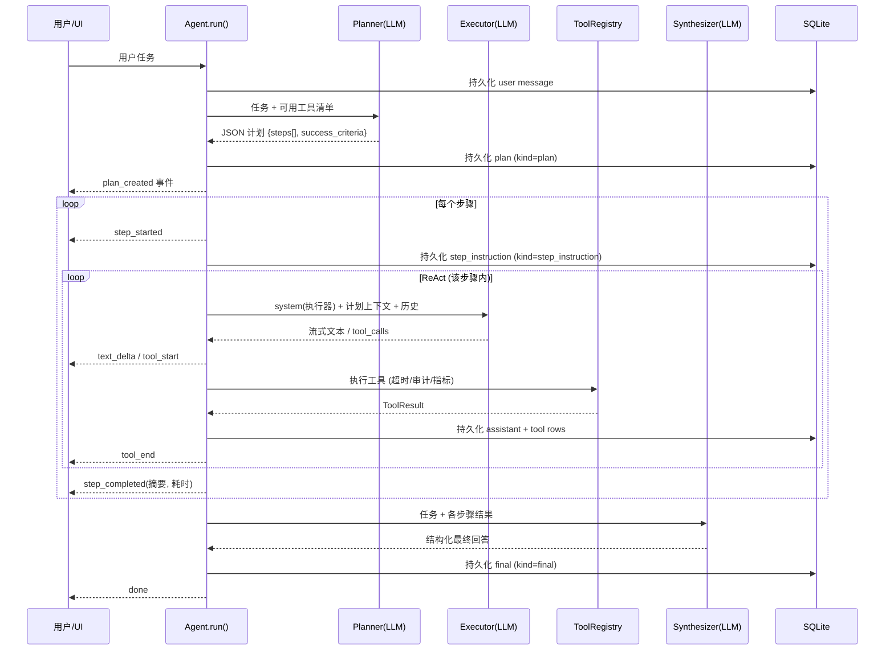

# AgentForge 架构详解

本文面向想深入理解系统设计的读者（包括面试官 :)）。分层介绍核心机制与取舍。

## 1. 总体分层

```
┌────────────────────────────────────────────────────┐
│ frontend/ (React+TS)   流式UI · 计划时间线 · Trace  │
├────────────────────────────────────────────────────┤
│ server/  (FastAPI)     SSE · REST · 认证 · 限流    │
├────────────────────────────────────────────────────┤
│ agent/   (运行时)      ReAct · Plan-and-Execute    │
│ ├── llm/   (网关)      多厂商 · 重试 · 故障转移     │
│ ├── tools/ (工具)      Schema校验 · 沙箱 · 审计     │
│ ├── rag/   (检索)      BM25+向量 · RRF融合         │
│ └── mcp_client.py      MCP 外部工具挂载            │
├────────────────────────────────────────────────────┤
│ persistence/ (SQLAlchemy/SQLite)  全量审计日志      │
└────────────────────────────────────────────────────┘
```

依赖方向自上而下单向。`agent/` 不知道 FastAPI 的存在，`eval/` 直接消费
`agent.run()` 的事件流 —— 这是评测能与生产共用同一条代码路径的原因。

## 2. Plan-and-Execute 时序



关键设计：

1. **步骤指令自包含**。Planner 的输出契约要求每条 `instruction` 独立可执行
   （执行器看不到原始对话），避免规划上下文丢失导致执行跑偏。
2. **每步完成即持久化**。客户端断连后已完成步骤与工具结果都在库里，
   Trace 可完整重建 —— 这是"部分进度不丢"的机制保证。
3. **复用同一个 ReAct 内循环**。规划模式每步就是一个带专属 system prompt
   的 ReAct 运行；没有第二套循环代码，也就没有第二套 bug。

## 3. LLM 网关：为什么自己写而不 SDK

统一事件模型 `Routed | TextDelta | ToolCallDelta | Finish` 是全部上层的
唯一视野。OpenAI 兼容与 Anthropic 两种线缆协议的解析差异（工具增量合并、
system 消息位置、usage 上报位置）都被压进适配器。

**重试与故障转移的边界**（这是面试里聊得最多的一段）：

- 适配器内部：指数退避 + 抖动重试 429/5xx/超时，**已产出事件后绝不重试**
- 注册表层：在**首个事件产出前**跨 provider 故障转移；产出后失败直接抛出

原因：一旦流式输出开始，切换 provider 重放会产生重复文本，消费端无法去重。
宁可报错让上层决定，不可静默重复。测试
`test_registry_no_failover_after_partial_output` 固化该行为。

## 4. 工具系统

```python
class Tool(ABC):
    name / description / parameters(JSON Schema) / timeout
    async execute(args, ctx) -> ToolResult
```

- `validate_args` 做最小 JSON-Schema 校验（required/type/enum），校验失败
  的错误文本**回传给模型**而不是抛异常 —— 模型可以自我纠正
- `ToolRegistry.run` 是唯一入口：统一超时、指标、异常兜底、审计落库
  （`tool_invocations` 表），Agent 循环因此永远不可能被一个坏工具炸掉
- MCP 工具经 `MCPToolProxy` 适配后与本地工具无差别竞争

## 5. 沙箱威胁模型（诚实版）

`python_repl` 提供的是**进程级隔离**：

- `python -I`（无用户 site-packages、不读环境配置）
- RLIMIT_CPU / RLIMIT_AS / RLIMIT_FSIZE / RLIMIT_CORE
- 墙钟超时 + kill，会话独立工作目录

它**不防御**：内核级逃逸、网络外呼、同机其他进程的信息泄露。生产多租户
场景的正确路径是 gVisor/Firecracker 或独立容器池（见
[decisions.md ADR-5](decisions.md)）。把它作为演示与内网工具而非安全边界，
是这个设计里最重要的诚实。

## 6. RAG：零依赖混合检索

- 分块：Markdown 标题感知 → 段落 → 句子边界截断，重叠拼接
- 向量：`HashingEmbedder`（md5 特征哈希，进程无关**确定性**，可跨重启复现）
  或 Provider `/embeddings`；BM25：jieba 分词 Okapi BM25
- 融合：RRF（`Σ 1/(60+rank)`），无需给两路分数做归一化标定
- 索引内存重建：SQLite 里的 chunk 是唯一事实，索引只是缓存，重启即重建

## 7. 可观测性

| 维度 | 载体 |
|---|---|
| 请求级 | `X-Request-ID` 贯穿 + 结构化 JSON access log |
| 业务级 | `messages` 表（含 kind=plan/step/final 标记）+ `tool_invocations` 审计 |
| 指标 | Prometheus：HTTP、LLM（按 provider/status/token）、工具、Agent 迭代结局 |
| 用户可见 | `/api/sessions/{id}/trace` + UI Trace 面板（从审计日志重建，非内存态） |

原则：**审计日志是事实，一切视图都是投影**。这让 Trace 在进程重启后依然
成立，也让评测器可以用和 UI 完全相同的数据源。
